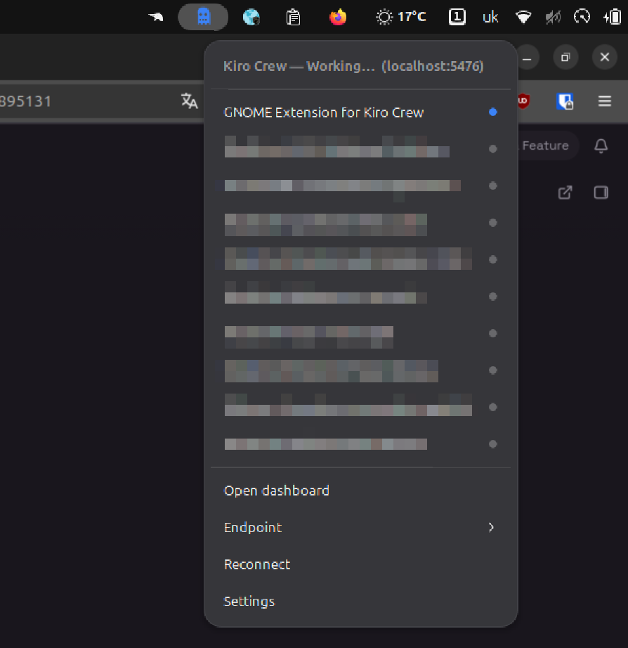

<p align="center">
  
</p>

# Kiro Crew — command your crew from the GNOME top bar 👻

[](https://www.gnu.org/licenses/old-licenses/gpl-2.0)
[](https://www.gnome.org/)
[](CHANGELOG.md)
[](https://github.com/totoshko88/kiro-crew-gnome/actions/workflows/ci.yml)

**Your AI crew is working right now — do you know what it's doing?**

This extension puts a little ghost in your GNOME top bar that watches your
whole [Kiro Crew](https://github.com/kirodotdev/kirocrew) and tells you, at a
glance, without opening a single browser tab:

- 🔵 **blue** — an agent is working
- 🟡 **amber** — an agent stopped and needs *you* (a question or an approval)
- 🔴 **red** — something broke, or the gateway is down
- ⚪ **grey** — all quiet

**One click takes you straight to the session that wants you** — not the home
page, not the last tab you had open, *the* one that needs attention. It is the
difference between babysitting a dashboard and running a crew.



> New here? Read the **[User Guide](docs/USERGUIDE.md)** — it walks you from zero to a
> glowing ghost in about five minutes.

## Why you want this

Kiro Crew agents keep working after you close the chat. They run long tasks,
answer on a schedule, spawn helpers, and wait for approvals — **unattended, on
your own hardware**. The catch: if nobody's watching, an agent can sit for an
hour stuck on one yes/no question.

That is the whole point of this extension. You stop checking the dashboard "just
in case." The ghost checks for you and only pulls you in when it matters.

## What you need first: Kiro Crew itself

The extension is a *remote control* — it needs the thing it controls. Kiro Crew
is a free, open-source workspace that runs AI agents **on your machine**, not in
someone's cloud. Install it once:

```bash
# One line. Installs the signed release, no cloning, no build.
curl -fsSL https://download.crew.kiro.dev/cli.sh | sh
```

Then start the gateway and open the dashboard:

```bash
kirocrew gateway        # starts the local gateway on http://localhost:5476
```

Prefer a container? Kiro Crew also ships as a Docker image bound to loopback:

```bash
docker run -d --name kirocrew \
  -p 127.0.0.1:5476:5476 \
  -v kirocrew-home:/home/kirocrew \
  ghcr.io/kirodotdev/kirocrew:stable
```

Full install paths (`.deb` / `.rpm` / AppImage, pinning a version, upgrades) are
in the official [install guide](https://github.com/kirodotdev/kirocrew/blob/main/docs/guides/install.md).

### Why "runs on your machine" actually matters

Letting an AI agent run shell commands, edit files, and hit the network sounds
scary — and it *should*, if it's a black box in someone else's cloud. Kiro Crew
is the opposite, and that is the real reason to use it:

- **It's on your hardware.** Your code, your tokens, your data never leave the
  machine unless you tell them to. The dashboard binds to `localhost` by
  default — nothing is exposed to the internet until you deliberately configure
  it.
- **It's sandboxed, not trusted blindly.** Kiro Crew runs agent work under
  **OS-level isolation where your system supports it** — on Linux that means
  kernel sandboxing (namespaces) and, on distros that ship it, an **AppArmor**
  profile. In plain words: even though an agent can run commands, the operating
  system fences off *what* it can touch — a misbehaving or tricked agent hits a
  wall instead of your whole home directory.
- **Defense in depth.** On top of the sandbox there are tool-approval prompts,
  sensitive-path checks (it won't quietly read your SSH keys), automatic
  credential redaction in logs, deny rules you control, and an audit trail of
  what ran. No single layer is the only thing standing between an agent and your
  system.
- **You can see everything.** Every tool call, approval, schedule, and log is
  visible in the dashboard — and now, with this extension, the *state* of it all
  is visible without even opening the dashboard.

So the pitch is simple: **powerful autonomous agents, kept on a short leash, on
a machine you own — and a ghost in your top bar watching the leash for you.**

## Install the extension

```sh
git clone https://github.com/totoshko88/kiro-crew-gnome
cd kiro-crew-gnome
make install
# Wayland: log out and back in. X11: Alt+F2, type 'r', Enter.
gnome-extensions enable kiro-crew@totoshko88.github.io
```

That's it. On a normal local setup the extension **fetches its own access
token** on first run (via the gateway's loopback-only local bootstrap — see the
[User Guide](docs/USERGUIDE.md)), so the ghost usually lights up with no further
steps. If it doesn't, open **Extensions → Kiro Crew → Settings** and either
press **Fetch** or paste a token from your dashboard.

## Requirements

- GNOME Shell 45–50.
- A running Kiro Crew gateway (default `http://localhost:5476`).

## How it reads your crew

- **Live state** — a WebSocket to `GET /api/ws`, frame `type:"slots"`. Each
  slot's `running` / `pending_approval` / `needs_input` / `mcp_report` is reduced
  to one indicator state (`lib/state.js`).
- **Recent sessions** — `GET /api/sessions?limit=N&preview=1`.
- **Token** — fetched automatically from the gateway's loopback-only
  `GET /api/token/local` bootstrap, which only works for a process on your own
  machine in the gateway's namespaces. The extension never mints a credential
  the forbidden way, and never calls a mutating endpoint.
- **Health / fallback** — `GET /api/status`, polled only while the WebSocket is
  down.

## Documentation

- **[User Guide](docs/USERGUIDE.md)** — install, first run, every menu, troubleshooting.
- [CONTRIBUTING.md](docs/CONTRIBUTING.md) — architecture, principles, how to help.
- [SECURITY.md](docs/SECURITY.md) — security policy and supported versions.
- [DISTRIBUTION.md](docs/DISTRIBUTION.md) — release and extensions.gnome.org process.

## Development

```sh
make schemas          # compile the GSettings schema in place
make test-logic       # run the pure state-machine unit tests (gjs)
make lint             # ESLint (needs `npm ci` first)
make validate         # GNOME review-guideline checks
```

### Layout

```
kiro-crew@totoshko88.github.io/
  extension.js   indicator, menu, lifecycle, auto-token
  prefs.js       Adwaita preferences (endpoint, token, Fetch / Open buttons)
  lib/client.js  Soup HTTP + WebSocket client (auth, reconnect, local bootstrap)
  lib/state.js   slot list → aggregate icon state (pure, testable)
  schemas/       GSettings schema
  icons/         four symbolic states (idle / busy / attention / error)
  stylesheet.css status tints
```

## Support

[](https://donatello.to/totoshko88)
[](https://send.monobank.ua/jar/2UgaGcQ3JC)

## License

GPL-2.0-or-later. See [LICENSE](LICENSE).
